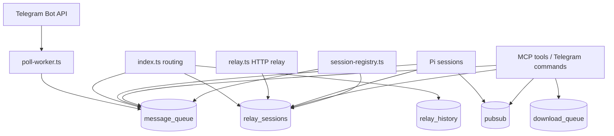
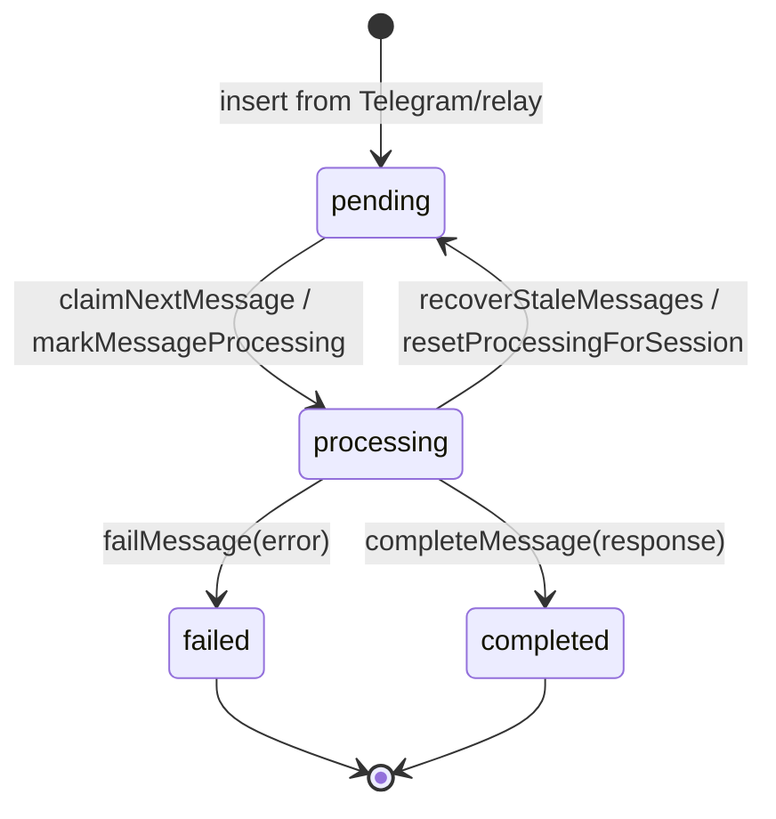
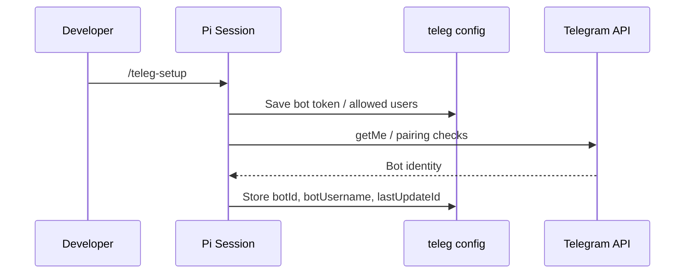
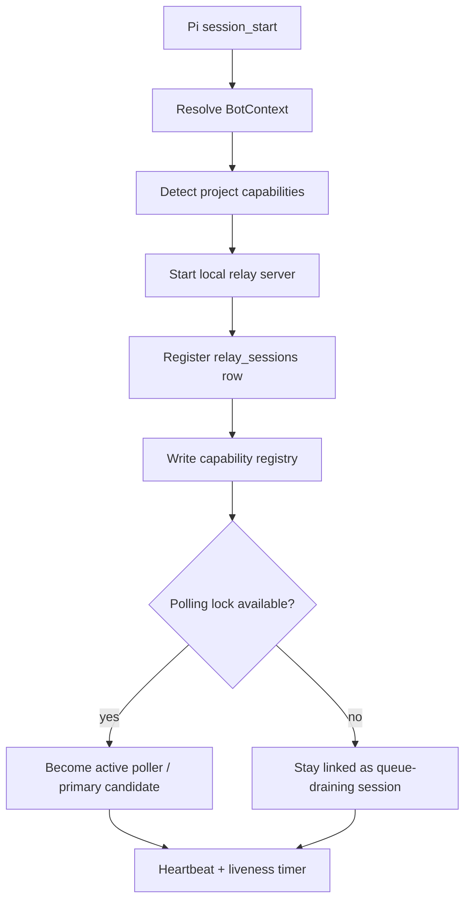
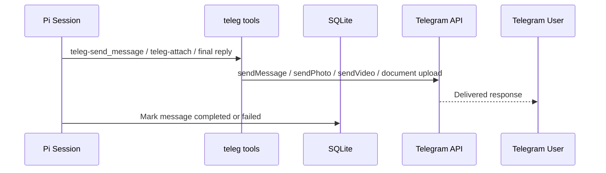
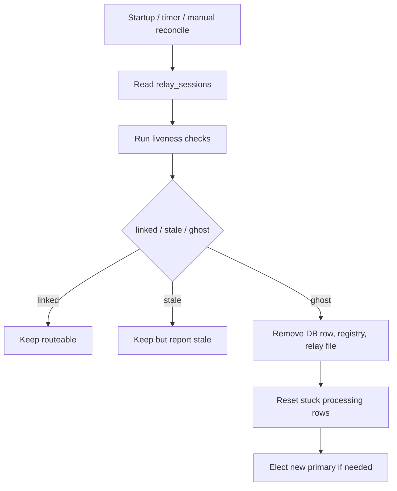
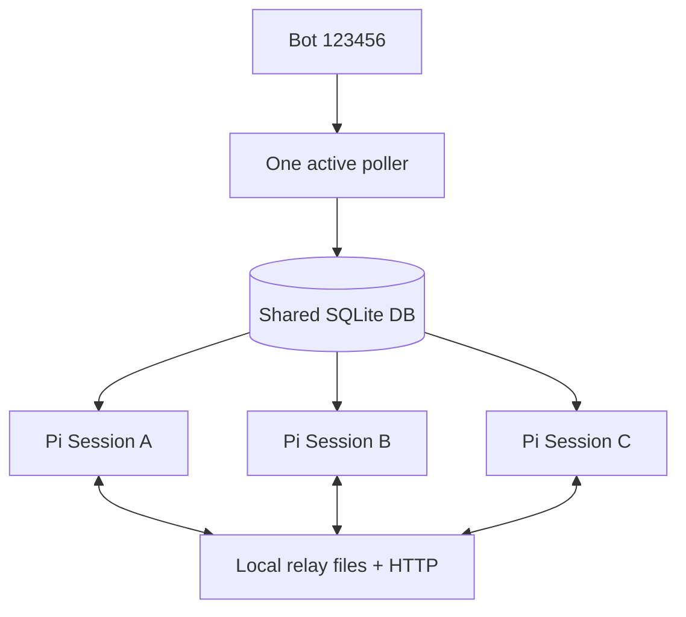
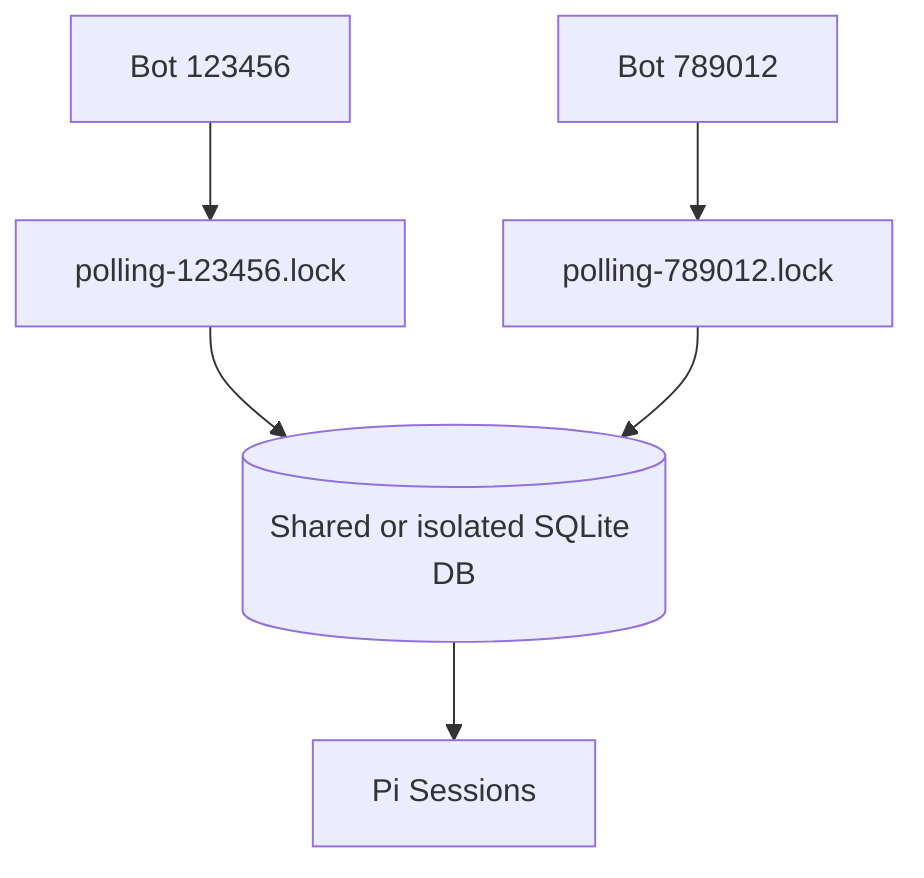

# pi-teleg / teleg-bridge

**Telegram Bridge Extension for Pi** — a multi-bot, multi-session Telegram bridge that connects Telegram chats to Pi agent sessions and routes messages to the best available project session by explicit address, declared capabilities, or primary-session fallback.

## Intent

`teleg-bridge` exists to make Telegram a practical control plane for Pi:

- Forward Telegram private, group, supergroup, and configured channel messages into active Pi sessions as `[telegram]` turns.
- Let several Pi sessions share one Telegram bot safely without duplicate polling.
- Route work to the session that owns the relevant project or capability.
- Send responses, generated files, photos, and videos back to Telegram.
- Keep queue and session state recoverable across crashes and restarts.
- Support more than one Telegram bot on the same host, scoped by `bot_id`.

The project is especially useful when you keep multiple specialized Pi sessions open, such as a media downloader, code workspace, scraping workspace, analysis workspace, and operations workspace, then want Telegram messages to land in the right one automatically.

## Core Capabilities

### Messaging and Telegram I/O

| Capability | Description |
|---|---|
| Telegram polling | Uses Telegram `getUpdates` through one active poller per bot token. |
| Message forwarding | Converts authorized Telegram messages into Pi turns prefixed with `[telegram]`. |
| Reply delivery | Sends final agent responses back to Telegram. |
| Chunked text replies | Handles Telegram message length constraints. |
| Photo and video sending | `teleg-send_photo` and `teleg-send_video` send local media files. |
| File attachments | `teleg-attach` queues local files to send with the next Telegram reply. |
| Typing indicator | Keeps Telegram chat informed while a turn is being processed. |

### Multi-session Routing

| Capability | Description |
|---|---|
| Direct routing | `@sessionName message` is relayed to the named live session. |
| Capability routing | Sessions declare capabilities in `INFO_REL.md`; messages are matched to live sessions. |
| URL-aware matching | Twitter/X, YouTube, and Reddit URLs can route to media/download-capable sessions. |
| Primary fallback | If no direct/capability match exists, the primary session for the bot handles the message. |
| Active queue workers | Linked sessions drain their own pending queue and can process assigned work. |
| Cross-session relay | Sessions communicate over local authenticated HTTP relay endpoints. |

### Reliability and Operations

| Capability | Description |
|---|---|
| Persistent queue | SQLite stores pending, processing, completed, and failed messages. |
| Bot-scoped state | Queue, relay sessions, downloads, locks, and stats are scoped by `bot_id`. |
| Polling lock | One lock file per bot prevents duplicate Telegram `getUpdates` consumers. |
| Crash recovery | Startup recovery can reset stale processing rows and clean old sessions. |
| Liveness checks | Validates PID, relay file, relay PID match, relay HTTP health, heartbeat, and DB row. |
| Ghost eviction | Dead sessions can be reconciled and evicted automatically or by command/tool. |
| Primary election | Elects or sets a primary session per bot. |
| Split-DB detection | Warns when the same bot is used with isolated databases. |

### Configuration

| Capability | Description |
|---|---|
| Global config | `~/.pi/agent/teleg-bridge.json` supports multiple bots. |
| Project config | `.pi/teleg.json` can provide project-local bot setup. |
| Environment override | `TELEG_BOT_TOKEN`, `TELEG_BOT_ID`, and `TELEG_DB_PATH` override defaults. |
| Session capability declaration | `INFO_REL.md` declares what a project/session handles. |

## High-level Architecture

```mermaid
flowchart LR
  User[Telegram User] --> Bot[Telegram Bot API]
  Bot --> Poller[Per-bot PollingManager]
  Poller --> Worker[Poll Worker Thread]
  Worker --> Queue[(SQLite message_queue)]
  Queue --> Router[Routing Decision]
  Router --> Direct[@sessionName]
  Router --> Caps[Capability Match]
  Router --> Primary[Primary Fallback]
  Direct --> Relay[Authenticated HTTP Relay]
  Caps --> Relay
  Relay --> Session[Target Pi Session]
  Primary --> Session
  Session --> Tools[MCP / Pi Tools]
  Tools --> Bot
  Bot --> User
```

### Runtime Components

| Component | Path | Responsibility |
|---|---|---|
| Extension entrypoint | `src/index.ts` | Registers Pi commands/tools, manages session lifecycle, drains queue, handles Telegram turns. |
| Configuration | `src/config.ts` | Resolves bot context, global/project config, DB path, bot migration, split-DB checks. |
| SQLite persistence | `src/db.ts` | Stores message queue, relay sessions, downloads, pub-sub, stats, and schema migrations. |
| Polling manager | `src/polling-manager.ts` | Starts/stops one worker per bot and maintains bot-specific polling locks. |
| Poll worker | `src/poll-worker.ts` | Long-polls Telegram and persists updates into SQLite. |
| Relay server/client | `src/relay.ts` | Runs local HTTP relay endpoints and forwards commands between sessions. |
| Session registry | `src/session-registry.ts` | Checks liveness, reconciles sessions, evicts ghosts, elects primary. |
| Session config | `src/session-config.ts` | Reads/writes session registry and user allowlist/archive settings. |
| Capability registry | `src/capabilities.ts` | Detects capabilities from project docs and matches messages to sessions. |
| MCP helper server | `mcp-server/index.js` | Exposes bridge operations as MCP tools. |
| Build output | `dist/` | Compiled JavaScript and TypeScript declarations. |

## SQLite Database Architecture

`teleg-bridge` uses a local SQLite database as the durable coordination layer between the poll worker, routing logic, relay sessions, queue drainers, and operational tools.

### Storage location and runtime mode

| Setting | Value / Behavior |
|---|---|
| Default path | `~/.pi/agent/teleg-bridge.db` |
| Override | `TELEG_DB_PATH=/path/to/teleg-bridge.db` |
| Journal mode | `PRAGMA journal_mode=WAL` for safer concurrent session access. |
| Busy timeout | `PRAGMA busy_timeout=5000` to reduce write-contention failures. |
| Sync mode | `PRAGMA synchronous=NORMAL` for WAL-friendly durability/performance balance. |
| Schema version | `PRAGMA user_version = 2` after migration. |
| Scope key | Most runtime tables are scoped by `bot_id`. |

### Database responsibility diagram



### Logical schema

```mermaid
erDiagram
  BOT ||--o{ MESSAGE_QUEUE : scopes
  BOT ||--o{ DOWNLOAD_QUEUE : scopes
  BOT ||--o{ RELAY_SESSIONS : scopes
  BOT ||--o{ PUBSUB : scopes
  RELAY_SESSIONS ||--o{ MESSAGE_QUEUE : claims_by_session_name
  RELAY_SESSIONS ||--o{ RELAY_HISTORY : from_or_to_session

  MESSAGE_QUEUE {
    integer id PK
    integer bot_id
    integer chat_id
    integer message_id
    integer from_user_id
    text from_username
    text text
    text session_id
    text session_name
    text status "pending|processing|completed|failed"
    text source "telegram|relay"
    text source_session
    integer created_at
    integer started_at
    integer completed_at
    text error
    text response
  }

  DOWNLOAD_QUEUE {
    integer id PK
    integer bot_id
    integer chat_id
    integer message_id
    text url
    text source "twitter|youtube|reddit|gallery|other"
    text session_name
    text status "pending|processing|completed|failed"
    integer retry_count
    text error
    text result
    integer created_at
    integer started_at
    integer completed_at
  }

  RELAY_SESSIONS {
    integer id PK
    integer bot_id
    text session_name
    text session_id
    integer pid
    integer port
    text secret
    text project_dir
    text capabilities "JSON array"
    text description
    text role "active|drain"
    integer is_primary
    integer registered_at
    integer last_heartbeat
  }

  RELAY_HISTORY {
    integer id PK
    text from_session
    text to_session
    integer chat_id
    text command
    integer success
    text error
    integer created_at
  }

  PUBSUB {
    integer id PK
    integer bot_id
    text channel
    text publisher
    text payload
    text target_session
    text consumed_by
    integer created_at
    integer consumed_at
  }
```



> `BOT` is a logical parent from global/project configuration, not a physical SQLite table. Relationships are enforced by query patterns and indexes rather than foreign-key constraints.

### Tables and indexes

| Table | Purpose | Important indexes / constraints |
|---|---|---|
| `message_queue` | Durable Telegram/relay work queue and processing history. | `idx_queue_status`, `idx_queue_session`, `idx_queue_chat`, `idx_queue_bot_id`, unique `idx_queue_dedup(bot_id, chat_id, message_id)`. |
| `download_queue` | Durable queue for media/download jobs discovered from messages. | `idx_dl_status`, `idx_dl_session`, `idx_dl_created`, `idx_dl_url`, `idx_dl_bot_id`. |
| `relay_sessions` | Live session registry mirrored from relay endpoints and heartbeats. | unique `idx_relay_name(bot_id, session_name)`, `idx_relay_pid`, `idx_relay_bot_id`. |
| `relay_history` | Audit trail for inter-session command relay attempts. | `idx_relay_history_time(created_at)`. |
| `pubsub` | Lightweight inter-session publish/subscribe queue. | `idx_pubsub_channel(channel, consumed_at)`, `idx_pubsub_target(target_session, consumed_at)`, `idx_pubsub_bot(bot_id, channel)`. |

### Queue state machine



### Main database flows

| Flow | Read / Write Path |
|---|---|
| Incoming Telegram update | `poll-worker.ts` inserts or deduplicates into `message_queue` by `(bot_id, chat_id, message_id)`. |
| Session claim | Queue drainers call `claimNextMessage` / `claimNextMessageForSession`, moving rows from `pending` to `processing`. |
| Route assignment | Router assigns `session_name` and synthetic `session_id` like `__session__:name` for targeted delivery. |
| Completion | Active turn completion updates `message_queue.status`, `completed_at`, `response`, or `error`. |
| Relay registration | Session startup writes `relay_sessions` with PID, port, secret, capabilities, role, and heartbeat. |
| Liveness reconciliation | `session-registry.ts` reads `relay_sessions`, validates relay/PID/heartbeat, evicts ghosts, and resets stuck queue rows. |
| Pub-sub delegation | `teleg-publish` inserts into `pubsub`; sessions consume rows by channel or target session. |
| Download tracking | URL/media jobs are tracked in `download_queue` with retry count, result, and error details. |

## Workflow

### 1. Setup workflow



1. Install dependencies with `npm install`.
2. Build with `npm run build`.
3. Deploy with `./deploy.sh`.
4. Run `/teleg-setup` inside Pi, or provide config/env variables.
5. Send `/start` or `/help` to the Telegram bot from an allowed user.

### 2. Session registration workflow



A session registers only when it has meaningful project context. The preferred declaration file is `INFO_REL.md`; fallback detection can use `AGENTS.md` or `README.md`.

### 3. Incoming message workflow

```mermaid
flowchart TD
  Msg[Telegram message] --> Auth{Allowed user?}
  Auth -- no --> Reject[Ignore / reject]
  Auth -- yes --> Command{Bridge command?}
  Command -- yes --> Cmd[Run command handler]
  Command -- no --> Persist[Persist to SQLite queue]
  Persist --> Direct{Starts with @sessionName?}
  Direct -- yes --> LiveTarget{Target live?}
  LiveTarget -- yes --> Relay[Forward via HTTP relay]
  LiveTarget -- no --> Fallback[Primary fallback]
  Direct -- no --> Match{Capability match?}
  Match -- yes --> CapLive{Matched session live?}
  CapLive -- yes --> Relay
  CapLive -- no --> Fallback
  Match -- no --> Fallback
  Fallback --> Primary[Assign to primary session]
  Relay --> Turn[Create [telegram] Pi turn]
  Primary --> Turn
  Turn --> Reply[Send response / attachments to Telegram]
```

Routing order is intentionally deterministic:

1. Telegram administrative and bridge commands.
2. Explicit `@sessionName` route.
3. Capability match from the active session registry.
4. Primary session fallback.

### 4. Response workflow



If a Telegram user asks for a generated file, the handling agent should call `teleg-attach` with the local file path before returning its final text response.

### 5. Reconciliation and recovery workflow



Liveness checks include:

- `pid_alive`
- `relay_file`
- `relay_pid_match`
- `relay_http`
- `heartbeat_fresh`
- `db_row`

## Routing and Capability Declaration

Create `INFO_REL.md` in a project root to describe what a Pi session should handle:

```markdown
# INFO_REL

## capabilities
media-download, twitter, youtube, reddit, gallery

## description
Downloads and archives media from various online sources.
```

This repository declares:

```markdown
# INFO_REL

## capabilities
telegram-bridge, messaging, relay, routing

## description
Multi-session Telegram bridge extension for Pi. Handles polling, session routing, message relay, and capability-based smart message distribution between Pi sessions.
```

Capability matching uses:

- Direct URL patterns for Twitter/X, YouTube, and Reddit.
- Capability keywords such as `twitter`, `youtube`, `reddit`, `media`, `download`, or `video`.
- Generic keyword matching against session descriptions.
- Live-process checks before selecting a route.

## Commands via Telegram

| Command | Description |
|---|---|
| `/start` or `/help` | Show help and pairing information. |
| `/status` | Show connection, sessions, relay state, queue, and bot info. |
| `/chatid` | Show current chat/user IDs for group/channel setup. |
| `/queue [session]` | Show queue information for a session or primary. |
| `/health` | Test connection. |
| `/healthfull` | Full diagnostic. |
| `/compact` | Compact Pi memory. |
| `/teleg-reconcile` | Reconcile sessions and evict ghosts. |
| `/teleg-sessions` | List sessions with liveness state. |
| `/teleg-set-primary <name>` | Set the primary session for the current bot. |
| `/teleg-bots` | List configured bots. |
| `/teleg-dc` or `/teleg-disconnect` | Disconnect this session. |
| `/teleg-dc-all` or `/teleg-disconnect-all` | Disconnect all sessions without cleaning DB state. |
| `/teleg-clean-db` | Reset processing queue and purge old entries. |
| `/teleg-remove-sessions` | Remove dead session registry records. |
| `stop` | Abort current turn. |

## Pi Commands

| Command | Description |
|---|---|
| `/teleg-setup` | Configure bot token and allowed user pairing. |
| `/teleg-status` | Show teleg-bridge status. |
| `/teleg-connect` | Start polling / connect bridge (offers existing bots to pick from). |
| `/teleg-disconnect` | Stop polling / disconnect bridge. |
| `/teleg-reconnect` | Force reconnect (offers existing bots to pick from). |
| `/teleg-switch-bot` | Switch the active bot for this session without re-entering its token. |

## MCP Tools for Agents

### Telegram I/O

| Tool | Description |
|---|---|
| `teleg-send_message` | Send text to Telegram. |
| `teleg-send_photo` | Send a local image file as a Telegram photo. |
| `teleg-send_video` | Send a local video file as a Telegram video. |
| `teleg-attach` | Queue one or more local files for the active Telegram reply. |
| `get_me` | Get bot identity information. |

### Queue and backlog operations

| Tool | Description |
|---|---|
| `get_queue_count` | Get pending/processing queue depth. |
| `get_queue_stats` | Get message and download queue stats. |
| `get_queue_data` | Inspect recent queue rows, optionally by status. |
| `get_queue_data_id` | Inspect a specific queue row. |
| `set_queue_status` | Manually set queue row status. |
| `teleg-clear_backlog` | Reset, purge, complete, fail, or delete queue rows. |

### Session, relay, and bot operations

| Tool | Description |
|---|---|
| `teleg-publish` | Publish a task to a capability channel or target session. |
| `teleg-disconnect` | Disconnect this Pi session. |
| `teleg-disconnect-all` | Disconnect all sessions connected to the bridge. |
| `teleg-clean-db` | Reset processing rows and purge old completed/failed rows. |
| `teleg-remove-sessions` | Remove dead or unwanted session registry records. |
| `teleg-reconcile` | Check liveness and evict ghost sessions. |
| `teleg-list_sessions` | List relay sessions with liveness state. |
| `teleg-evict_session` | Evict a session and optionally reset its queue / kill PID. |
| `teleg-list_bots` | List configured Telegram bots. |
| `teleg-set_primary` | Set a primary session for a bot. |

## Configuration

### Environment Variables

| Variable | Default | Purpose |
|---|---:|---|
| `TELEG_BOT_TOKEN` | — | Force token for the current process. |
| `TELEG_BOT_ID` | — | Select a bot from global config. |
| `TELEG_PROJECT_DIR` | `process.cwd()` | Project folder used to read `.pi/teleg.json` for the current process / MCP server. |
| `TELEG_DB_PATH` | `~/.pi/agent/teleg-bridge.db` | SQLite DB path shared by sessions. |
| `TELEG_LIVENESS_MS` | `300000` | Max heartbeat age before a session is stale. |
| `TELEG_DRAIN_INTERVAL_MS` | `12000` | Idle queue drain interval. |
| `TELEG_CLAIM_OTHERS` | `0` | Allow a session to claim messages assigned to other sessions. |

### Group, Supergroup, and Channel Support

The bridge can process requests made outside private chats:

| Chat type | Authorization model | Notes |
|---|---|---|
| Private chat | `from.id` must be in `allowedUserIds`, except first `/start` or `/help` pairing when no users are configured. | Replies go to the private chat. |
| Group / supergroup | `from.id` must be in `allowedUserIds`. | The same configured user can request work from another chat; replies are sent back to that group thread/message. Bot privacy mode may limit which group messages Telegram delivers. |
| Channel | `chat.id` must be in `allowedChatIds`. | Telegram channel posts usually do not expose an author user ID to bots, so channel authorization must be chat-based. The bot must be an admin or otherwise permitted to read/respond. |

Use `/chatid` from an authorized group/supergroup user to discover the current chat ID. For channels, configure the channel ID manually in `allowedChatIds` because user identity is normally unavailable in channel posts.

Important Telegram behavior:

- In groups with BotFather privacy mode enabled, bots generally receive commands, replies to the bot, and mentions, not every message.
- To receive normal group messages, disable bot privacy mode in BotFather or ask users to command/mention the bot.
- Channel posts are authorized by `allowedChatIds`, not `allowedUserIds`, because Telegram does not reliably provide the posting admin identity to bots.

### Global Config: `~/.pi/agent/teleg-bridge.json`

```json
{
  "version": 2,
  "defaultBotId": 123456789,
  "bots": {
    "123456789": {
      "botToken": "TOKEN",
      "botUsername": "my_bot",
      "allowedUserIds": [987654321],
      "allowedChatIds": [-1001234567890],
      "lastUpdateId": 0
    }
  }
}
```

### Project Config: `.pi/teleg.json`

```json
{
  "botId": 123456789,
  "botToken": "TOKEN",
  "botUsername": "my_bot",
  "allowedUserIds": [987654321],
  "allowedChatIds": [-1001234567890],
  "lastUpdateId": 0,
  "dbPath": "/path/to/teleg-bridge.db"
}
```

## State and Data Files

| File / Directory | Purpose |
|---|---|
| `~/.pi/agent/teleg-bridge.db` | Default shared SQLite database. |
| `~/.pi/agent/teleg-bridge.json` | Global multi-bot configuration. |
| `~/.pi/agent/teleg-capabilities.json` | Runtime capability registry. |
| `~/.pi/agent/tmp/teleg-bridge/polling-{botId}.lock` | Per-bot polling lock. |
| `.pi/teleg.json` | Optional project-local bot pin used by the extension and MCP server. |
| `INFO_REL.md` | Project capability declaration. |

## Deployment Scenarios

### Same host, multiple Pi sessions, one bot



All sessions must share the same `TELEG_DB_PATH`. Only one session polls Telegram; all linked sessions can process work routed or assigned to them.

### Same host, multiple bots



Each bot has independent polling, lock, offset, queue scoping, and primary session selection.

### Mixed shared / isolated deployments

Use separate `TELEG_DB_PATH` values for intentionally isolated environments, such as dev and prod. Do **not** split the DB for sessions that are meant to share the same bot and queue.

## Anti-patterns and Fixes

### Same bot, split DB

```text
Wrong: Session A uses /path/a.db and Session B uses /path/b.db with the same bot token.
Result: isolated queues, no shared routing, confusing primary ownership.
Fix: set the same TELEG_DB_PATH for all sessions sharing a bot.
```

### Ghost primary

```text
Wrong: primary session is killed and stale rows remain processing forever.
Fix: run /teleg-reconcile, /teleg-clean-db, or use teleg-evict_session.
```

### Missing INFO_REL.md

```text
Wrong: project session has no clear capabilities, so routing falls back to primary.
Fix: add INFO_REL.md with capabilities and a concise description.
```

## Installation

`teleg-bridge` ships a single `install.sh` dispatcher that handles the full
git-based lifecycle: **install / update / uninstall / status / version**. Git
operations are host-agnostic, so the same flow works for **GitHub, gitlab.com,
and self-hosted GitLab** remotes.

### One-liner (public)

```bash
# GitHub
curl -fsSL https://raw.githubusercontent.com/<owner>/<repo>/HEAD/install.sh | bash

# GitLab (gitlab.com OR self-hosted — same shape)
curl -fsSL https://<host>/<owner>/<repo>/-/raw/HEAD/install.sh | bash
```

This clones the canonical upstream to **`~/.teleg-bridge`** (override with
`TELEG_HOME`), runs `npm install` + build, wires `~/.pi/agent/settings.json` and
`~/.pi/agent/mcp.json`, and installs a `teleg` shim at `~/.local/bin/teleg`.
Re-running the one-liner is always safe — it acts as an update.

To target a fork or another host, pass `--repo` and `--host`:

```bash
curl -fsSL https://raw.githubusercontent.com/<owner>/<repo>/HEAD/install.sh | bash -s -- --repo myorg/myfork --host github.com
```

To review the script before running:

```bash
curl -fsSL https://<host>/<owner>/<repo>/-/raw/HEAD/install.sh -o install.sh && less install.sh && bash install.sh
```

### Lifecycle commands

After install, the `teleg` shim is on your `PATH`:

| Command | Description |
|---|---|
| `teleg status` | Show install path, remote, channel, ref, and whether an update is available. |
| `teleg version` | Print `package.json` version + `git describe`. |
| `teleg update` | `git fetch` → advance to the channel's latest ref → rebuild → re-wire config. |
| `teleg update --channel stable` | Switch to the highest semver tag (falls back to edge with a warning if none are tagged yet). |
| `teleg update --keep` | Stash (instead of discarding) any local edits in the managed checkout. |
| `teleg uninstall` | Remove the checkout, prune Pi config keys, remove the shim — **preserve bot config + database**. |
| `teleg uninstall --purge -y` | Also delete `~/.pi/agent/teleg-bridge.json` and `teleg-bridge.db`. |

### Channels

- **`edge`** (default): track the remote's default branch (discovered dynamically — never assumed to be `main`/`master`/`dev`).
- **`stable`**: pin to the highest semver tag reachable from the default branch. Requires releases to be tagged; until then it falls back to `edge` with a one-time warning.

### Private repositories

For a private remote, the `curl` one-liner must carry a token, and the cloned
`origin` should likewise be credentialed or use SSH:

```bash
# GitLab (self-hosted or gitlab.com)
curl -fsSL -H "PRIVATE-TOKEN: $GITLAB_TOKEN" https://<host>/<owner>/<repo>/-/raw/HEAD/install.sh | bash
# GitHub
curl -fsSL -H "Authorization: Bearer $GITHUB_TOKEN" https://raw.githubusercontent.com/<owner>/<repo>/HEAD/install.sh | bash
```

If `teleg update` hits a 401/403 it prints a clear "private repo: configure a
credentialed or SSH remote" message and exits non-zero without changing config.

### Manual / development install

From a clone (e.g. for hacking on the bridge itself):

```bash
git clone <repository-url>
cd pi-teleg
npm install
npm run build
./deploy.sh          # build + wire ~/.pi/agent config (portable, non-clobbering)
```

`deploy.sh` resolves the MCP-server path relative to its own location (so it
works from any checkout) and merges **only** the `teleg-bridge` key into
`mcp.json` — your other `mcpServers` and `imports` are preserved.

## Development

```bash
npm run build      # compile TypeScript
npm run dev        # watch compile
npm run deploy     # deploy extension
npm run deploy:watch
```

## Related Documentation

- Interactive architecture page: [`README.html`](./README.html)
- Phase plan: [`docs/PLAN_ACTION.md`](./docs/PLAN_ACTION.md)
- Integration notes: [`docs/PHASE3_INTEGRATION.md`](./docs/PHASE3_INTEGRATION.md)
- Group/channel support: [`docs/GROUP_CHANNEL_SUPPORT.md`](./docs/GROUP_CHANNEL_SUPPORT.md)
- Graph report: [`graphify-out/GRAPH_REPORT.md`](./graphify-out/GRAPH_REPORT.md)

## Recent Graphify Snapshot

The project graph was refreshed after group/channel support changes:

- Graph report: [`graphify-out/GRAPH_REPORT.md`](./graphify-out/GRAPH_REPORT.md)
- Interactive graph: [`graphify-out/graph.html`](./graphify-out/graph.html)
- Graph JSON: [`graphify-out/graph.json`](./graphify-out/graph.json)

## License

MIT
